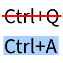

# Universal Shortcuts

This is a Fabric mod for Minecraft that fixes [MC-121278](https://bugs.mojang.com/browse/MC-121278), making <kbd>Ctrl</kbd>+<kbd>A</kbd> and other keyboard shortcuts work on non-QWERTY keyboard layouts.

## Q&A

### What shortcuts are supported?

This mod does not add shortcuts. It makes the shortcuts that are already supported by Minecraft work on non-QWERTY keyboard layouts. Those shortcuts are:
- Select all (<kbd>Ctrl</kbd>+<kbd>A</kbd>),
- Copy (<kbd>Ctrl</kbd>+<kbd>C</kbd>),
- Paste (<kbd>Ctrl</kbd>+<kbd>V</kbd>),
- Cut (<kbd>Ctrl</kbd>+<kbd>X</kbd>),
- All [debug combinations](https://minecraft.fandom.com/wiki/Debug_combination).[^1]

[^1]: The shortcut to toggle the narrator (<kbd>Ctrl</kbd>+<kbd>F3</kbd>+<kbd>B</kbd>) is not supported for technical reasons; see [#3](https://github.com/MDLC01/universal-shortcuts-mc/issues/3).

### How does it work?

By implementing the fix that is suggested on [the bug report for MC-121278](https://bugs.mojang.com/browse/MC-121278). That is, testing for the key name instead of its location on the keyboard.

### What about non-Latin keyboard layouts?

This is a good question to which I unfortunately do not have a good answer. There are two possibilities: either your keyboard is capable of producing Latin letters, in which case you may be able to use the shortcuts, or it is not capable of doing so, in which case this mod will completely disable keyboard shortcuts. See [#1](https://github.com/MDLC01/universal-shortcuts-mc/issues/1) for more information.
